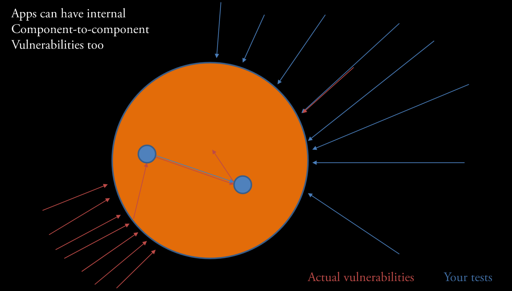
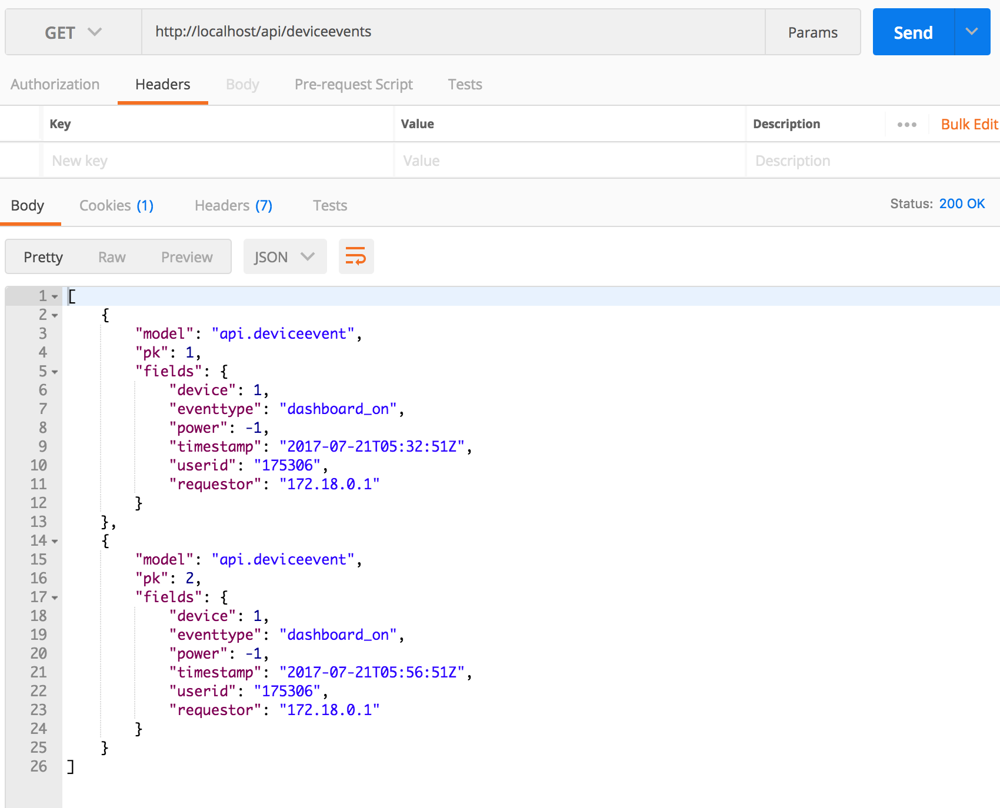
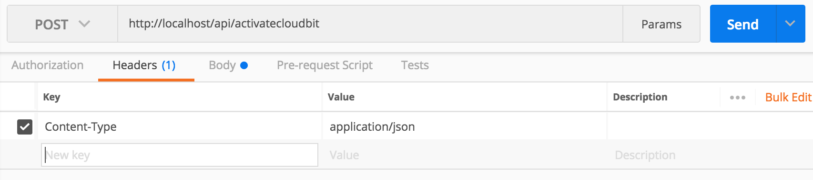
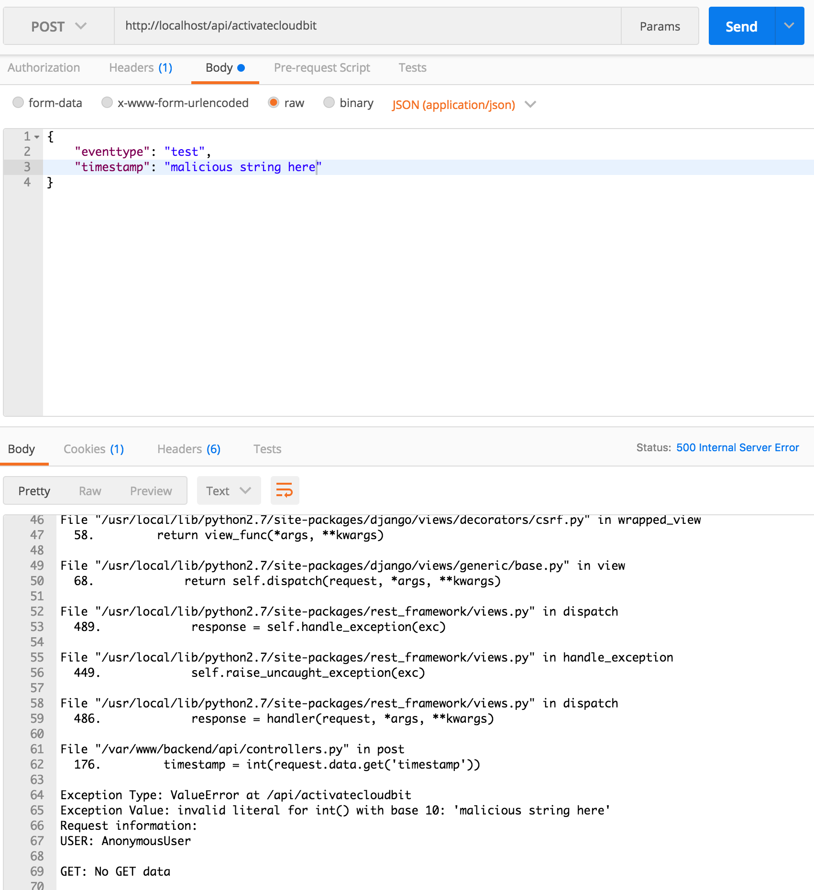
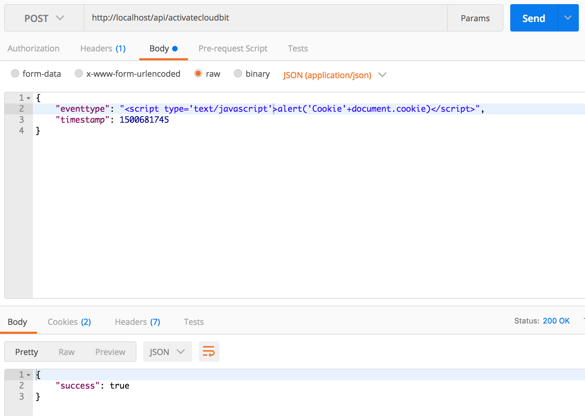

# Penetration Testing

### Introduction
In this module, you will probe the server you created before to see how insecure API endpoints can be.

### Goals
By the end of this tutorial, you will be able to:
* Use a REST Client to make malicious `POST` and `GET` requests to an `API`
* Identify and understand basic `software testing` paradigms
* Identify `software weaknesses` in API endpoints
* Trace exploit `weaknesses` to identify `vulnerabilities`
* Conduct a `risk assessment`


### Materials Required
For this lesson, you will need:

* PC
* Internet connection
* Little bits cloud bit and API Key
* Little bits sensor and actuator


### Table of Contents
<!-- TOC START min:1 max:3 link:true update:true -->
- [Penetration Testing](#penetration-testing)
    - [Cybersecurity First Principles in this lesson](#cybersecurity-first-principles-in-this-lesson)
    - [Introduction](#introduction)
    - [Goals](#goals)
    - [Materials Required](#materials-required)
    - [Table of Contents](#table-of-contents)
    - [Step 1: Where are we going?](#step-1-where-are-we-going)
    - [Step 2: Background on HTTP and REST](#step-2-background-on-http-and-rest)
    - [Step 3: Key Penetration Testing Concepts](#step-3-key-penetration-testing-concepts)
    - [Step 4: Penetration testing process](#step-4-penetration-testing-process)
    - [Step 4: Getting started testing in POSTMAN](#step-4-getting-started-testing-in-postman)
    - [Step 5: Exploring Authentication and permissions](#step-5-exploring-authentication-and-permissions)
    - [Step 6: Examine the attack surface of our app](#step-6-examine-the-attack-surface-of-our-app)
    - [Step 7: Explore the `ActivateCloudbit` endpoint](#step-7-explore-the-activatecloudbit-endpoint)
    - [Step 8: Perform a similar analysis on the other endpoints](#step-8-perform-a-similar-analysis-on-the-other-endpoints)
    - [Step 9: Exploring Error Handling Behavior](#step-9-exploring-error-handling-behavior)
    - [Step 10: Risk Assessment - Summarizing your test results](#step-10-risk-assessment---summarizing-your-test-results)
    - [Additional Resources](#additional-resources)
    - [Acknowledgements](#acknowledgements)
    - [License](#license)

<!-- TOC END -->


### Step 1: Where are we going?
I've created an a little app and an `API Endpoint` that lets you message this little `Cloudbit` device. Our endpoint uses `REST`. In this lesson, we will learn a little about REST and learn about a security activity called `penetration testing`.

### Step 2: Background on HTTP and REST
Before we get started, lets talk about what an `API` is.

> This background text and its associated images are modified for this setting by Matt Hale. Modifications are licensed under creative commons share-alike. The original material it is based upon was created by the Mozilla foundation and its contributors. Credit: https://developer.mozilla.org/en-US/docs/Web/HTTP/Overview#
https://developer.mozilla.org/en-US/docs/Web/HTTP/Messages

**HTTP** is a `protocol` which allows the fetching of resources, such as HTML documents. It is the foundation of any data exchange on the Web and a client-server protocol, which means requests are initiated by the recipient, usually the Web browser. A complete document is reconstructed from the different sub-documents fetched, for instance text, layout description, images, videos, scripts, and more.


Clients and servers communicate by exchanging individual messages (as opposed to a stream of data). The messages sent by the client, usually a Web browser, are called `requests` and the messages sent by the server as an answer are called `responses`.

Designed in the early 1990s, HTTP is an extensible protocol which has evolved over time. It is an application layer protocol that is sent over `TCP`, or over a `TLS`-encrypted TCP connection, though any reliable transport protocol could theoretically be used. Due to its extensibility, it is used to not only fetch hypertext documents, but also images and videos or to post content to servers, like with HTML form results. HTTP can also be used to fetch parts of documents to update Web pages on demand.

#### HTTP Messages

HTTP messages are composed of textual information encoded in ASCII, and span over multiple lines. In HTTP/1.1, and earlier versions of the protocol, these messages were openly sent across the connection. In HTTP/2, the once human-readable message is now divided up into HTTP frames, providing optimization and performance improvements.

Web developers, or webmasters, rarely craft these textual HTTP messages themselves: software, a Web browser, proxy, or Web server, perform this action. They provide HTTP messages through config files (for proxies or servers), APIs (for browsers), or other interfaces.


The HTTP/2 binary framing mechanism has been designed to not require any alteration of the APIs or config files applied: it is broadly transparent to the user.

HTTP requests, and responses, share similar structure and are composed of:

1.  A `start-line` describing the requests to be implemented, or its status of whether successful or a failure. This start-line is always a single line.
2.  An optional set of `HTTP headers` specifying the request, or describing the body included in the message.
3.  A blank line indicating all meta-information for the request have been sent.
4.  An optional `body` containing data associated with the request (like content of an HTML form), or the document associated with a response. The presence of the body and its size is specified by the start-line and HTTP headers.

The start-line and HTTP headers of the HTTP message are collectively known as the `head` of the requests, whereas its payload is known as the `body`.


#### HTTP Requests

##### Start line

`HTTP requests` are messages sent by the client to initiate an action on the server. Their `start-line` contain three elements:

1.  An **HTTP Method**, a verb (like `GET`, `PUT`, `POST`, or `DELETE`) or a noun (like `HEAD` or `OPTIONS`), that describes the action to be performed. For example, `GET` indicates that a resource should be fetched or `POST` means that data is pushed to the server (creating or modifying a resource, or generating a temporary document to send back). `PUT` modifies an existing resource, while `DELETE` removes one.
2.  The **request target**, usually a `URL`, or the absolute path of the protocol, port, and domain are usually characterized by the request context. The format of this request target varies between different HTTP methods. It can be
    *   An absolute path, ultimately followed by a `'?'` and query string. This is the most common form, known as the _origin form_, and is used with `GET`, `POST`, `HEAD`, and `OPTIONS` methods.  
        `POST / HTTP 1.1  
        GET /background.png HTTP/1.0  
        HEAD /test.html?query=alibaba HTTP/1.1  
        OPTIONS /anypage.html HTTP/1.0`
    *   A complete URL, known as the _absolute form_, is mostly used with `GET` when connected to a proxy.  
        `GET http://developer.mozilla.org/en-US/docs/Web/HTTP/Messages HTTP/1.1`
    *   The authority component of a URL, consisting of the domain name and optionally the port (prefixed by a `':'`), is called the _authority form_. It is only used with `CONNECT` when setting up an HTTP tunnel.  
        `CONNECT developer.mozilla.org:80 HTTP/1.1`
    *   The _asterisk form_, a simple asterisk (`'*'`) is used with `OPTIONS`, representing the server as a whole.  
        `OPTIONS * HTTP/1.1`
3.  The **HTTP version** which defines the structure of the remaining message, acting as an indicator of the expected version to use for the response.

#### Headers

`HTTP headers` from a request follow the same basic structure of an HTTP header: a case-insensitive string followed by a colon (`':'`) and a value whose structure depends upon the header. The whole header, including the value, consist of one single line, which can be quite long.

There are numerous request headers available. They can be divided in several groups:

*   **General headers**, like `Via`,  apply to the message as a whole.
*   **Request headers**, like `User-Agent`, `Accept-Type`, modify the request by specifying it further (like `Accept-Language`), by giving context (like `Referer`), or by conditionally restricting it (like `If-None`).
*   **Entity headers**, like `Content-Length` which apply to the body of the request. Obviously there is no such header transmitted if there is no body in the request.


#### Body

The final part of the request is its body. Not all requests have one: requests fetching resources, like `GET`, `HEAD`, DELETE, or OPTIONS, usually don't need one. Some requests send data to the server in order to update it: as often the case with `POST` requests (containing HTML form data).

Bodies can be broadly divided into two categories:

*   **Single-resource bodies**, consisting of one single file, defined by the two headers: `Content-Type` and `Content-Length`.
*   **[Multiple-resource bodies](https://developer.mozilla.org/en-US/docs/Web/HTTP/Basics_of_HTTP/MIME_types#multipartform-data)**, consisting of a `multipart body`, each containing a different bit of information. This is typically associated with `HTML Forms`.

#### HTTP Responses

##### Status line

The start line of an HTTP response, called the `status line`, contains the following information:

1.  The `protocol version`, usually `HTTP/1.1`.
2.  A `status code`, indicating success or failure of the request. Common status codes are `200` (ok), `404` (Not found), or `500` (Server error)
3.  A `status text`. A brief, purely informational, textual description of the status code to help a human understand the HTTP message.

A typical status line looks like: `HTTP/1.1 404 Not Found.`

#### Headers

`HTTP headers` for responses follow the same structure as any other header: a case-insensitive string followed by a colon (`':'`) and a value whose structure depends upon the type of the header. The whole header, including its value, presents as a single line.


#### Body

The last part of a response is the `body`. Not all responses have one: responses with a status code, like `201` or `204`, usually don't.

Bodies can be broadly divided into three categories:

*   **Single-resource bodies**, consisting of a single file of known length, defined by the two headers: `Content-Type` and `Content-Length`.
*   **Single-resource bodies**, consisting of a single file of unknown length, encoded by chunks with `Transfer-Encoding` set to `chunked`.
*   **[Multiple-resource bodies](https://developer.mozilla.org/en-US/docs/Web/HTTP/Basics_of_HTTP/MIME_types#multipartform-data)**, consisting of a multipart body, each containing a different section of information. These are relatively rare.

### Step 3: Key Penetration Testing Concepts
`Penetration testing` is a special kind of `software testing` that evaluates the `attack surface` of an application for potential `software weaknesses` that if left unaddressed can lead to exploitable `vulnerabilities`. At the end of a penetration test, testers have more information about their product and more `assurance` that it will operate correctly in the real world. This section overviews the basics of testing.

At its core, penetration testing, is about trying to **make an app do something it wasn't designed for** and **discover oversights or problems in the implementation and design**.

First of all, what is this?


 > Image credit: Bruegge and Dutoit, _Object-oriented Software Engineering: Using UML, Patterns, and Java_, Prentice Hall, 2010

* It all depends on what the goal of the app is. Maybe this is _how it is supposed to work_ - but probably not.

* `Errors` are when things are about to go wrong. The system enters an `error state`
* `Faults` are the root causes of `errors`
* `Failures` occur after errors and can potentially bring down or harm other systems leading to more errors and failures.


 > Image credit: Bruegge and Dutoit, _Object-oriented Software Engineering: Using UML, Patterns, and Java_, Prentice Hall, 2010

#### Reasons for Errors
There can be many different scenarios that lead to errors.
* Maybe the design is bad.
* Maybe something went wrong with the implementation (an `algorithm fault`)
* Maybe something occurs in the deployment environment that changes the setup and causes a `mechanical fault`


> Image credit: Bruegge and Dutoit, _Object-oriented Software Engineering: Using UML, Patterns, and Java_, Prentice Hall, 2010


 > Image credit: Bruegge and Dutoit, _Object-oriented Software Engineering: Using UML, Patterns, and Java_, Prentice Hall, 2010

#### What can we do about errors and faults?
We can Test! The goal of testing is to discover `faults` before they lead to `errors`. Once we know what is wrong, we can `mitigate` it in some way to prevent it from becoming an issue.

* Testing often means traversing the different ways in which your app operates.
* This is especially true for `penetration` tests which identify `security faults` (commonly known as `software weaknesses`).


> Image credit: Bruegge and Dutoit, _Object-oriented Software Engineering: Using UML, Patterns, and Java_, Prentice Hall, 2010

* Once we know, from testing, that `faults` exist, we can `patch` our code to remove it and prevent errors.


> Image credit: Bruegge and Dutoit, _Object-oriented Software Engineering: Using UML, Patterns, and Java_, Prentice Hall, 2010

* Another option is to design our app from the beginning to handle faults better by design. This is a concept called `redundancy`. Redundancy is vitally important for high-criticality systems like those that are operated by NASA, The Department of Defense, and others. `Redundancy` helps, in combination with patching, to ensure that if `errors` do occur they don't cause `failures` before they can be patched.


> Image credit: Bruegge and Dutoit, _Object-oriented Software Engineering: Using UML, Patterns, and Java_, Prentice Hall, 2010

* You can also embrace the chaos. It usually doesn't go well...


> Image credit: Bruegge and Dutoit, _Object-oriented Software Engineering: Using UML, Patterns, and Java_, Prentice Hall, 2010

* Author note: I love these images from Bruegge and Dutoit!

### Step 4: Penetration testing process
Ok, so we understand the basics of testing. How do developers think about penetration testing?

Often `use cases` and `user stories` are used to define what a system should be doing.
* Lets look at our app, open `Google Chrome` and visit http://137.48.191.135/
* This app allows a user to turn on a `cloudbit` (a Little IoT App I own).
* For our app, some user stories might be:
1. As a **cloudbit owner**, I want to **control my lights from my phone**, so that _I don't have to get off the couch to turn them on or off_.
1. As a **cloudbit owner**, I want to **view previous device events**, so that _I know when my device was used_.

Once you know what the app _should_ do, you can define `misuse cases` or `misuser stories` that describe how bad actors might abuse or impair the use cases and user stories. These `misuse` scenarios guide the kind of penetration testing you might do.

Anytime your app is on the internet you end up having a basic set of `misuse cases` that revolve around the exploitation of web resources for nefarious purposes.

A short list of misuse cases includes:
* Data theft
* User data exfiltration
* Hostile server takeover

These goals, which can be written like `user stories` often involve some form of `web-based-attack`. We are going to look at a server I've made for you.

In general, you can follow this flow chart for thinking about penetration testing (and testing in general):


* A `test case` is just a series of steps to see if the test fails or succeeds
* A `mitigation` is a process to correct the `faults` identified during testing.

#### Test Coverage
In practice, when you are evaluating real-world apps, you want to have strong `coverage` across the app's `attack surface` to ensure you don't miss something by being too focused in one particular area.

I like to think of tests graphically:


* In this example, most of the tests that have been conducted are located on part of the app that (as it turns out) doesn't have many vulnerabilities. These tests identify one `weakness` (upper right) that leads to a `vulnerability` but miss a highly vulnerable area of the app (lower left).
* Maybe this vulnerable area is a `component` that is outdated or not well designed.

Unfortunately, the surface is not the only place where vulnerabilities can occur.



* `Attack vectors` (i.e. pathways that exploit `weaknesses` to produce `vulnerabilities`) can sometimes use identified vulnerabilities to get access to other areas in your app. Those internal components might be less `hardened` against attack.
* Takeaway: It is important to test **all** of your components and surfaces.

### Step 4: Getting started testing in POSTMAN
Ok, so we have this pretty cool API and nice client-side interface to use it. However, as you will see, our API is, by default, pretty insecure! In the next sections, we will see just how bad it is by using some penetration tests to identify and highlight problems.

* Install `POSTMAN` by visiting https://www.getpostman.com/ and downloading the x32 (32 bit) app for windows.
* Once the file has downloaded, double click the icon to install it.
* Once `POSTMAN` is installed, launch it from `Chrome` by visiting `chrome://apps` and clicking the POSTMAN icon
* Now open `POSTMAN` and send a simple `GET` request to your local server at `http://137.48.191.135/`.
* What do you get?
* Now try sending a `GET` request to `http://137.48.191.135/`
* What do you see?

### Step 5: Exploring Authentication and permissions
The first issue on our server is that it doesn't enforce `authentication`. This violates the __least privilege__ first principle because anonymous users should only be able to login, not see or interact with data.

* Lets go back to our browser and go to http://137.48.191.135/.
* What do you see?


> Note your data items probably look slightly different than mine, since I am developing this lesson and haven't loaded much data in the app!

What gives? Our data is visible when we are logged out.
This is because our server is not enforcing authentication on its `API endpoints`.

That means that anyone can get this data?
> Yeah pretty much.

Lets confirm this from `POSTMAN`:

* open your `POSTMAN` window
* Make a `GET` request to `http://137.48.191.135/api/deviceevents`


> Note your data items probably look slightly different than mine, since I am developing this lesson and haven't loaded much data in the app!

* Notice that we have no headers in the request and we are not sending username/password or any kind of key as part of the request. It just works!
* This means that we can get all of the device event data on the server without even logging in!

### Step 6: Examine the attack surface of our app
Our web server exposes several endpoints for end-user consumption. Specifically, our server is setupt to accept HTTP requests at:

* `/api/session` -> controllers.Session (Class)
* `/api/register` -> controllers.Register (Class)
* `/api/deviceevents` -> controllers.DeviceEvents (Class)
* `/api/activatecloudbit` -> controllers.ActivateCloudbit (Class)
* `css-example/` -> controllers.css_example (method that demonstrates cross-site scripting),
* `/*` -> controllers.home (Single Method that serves up our frontend client)

That means we need to assess the security of each of the endpoints.

### Step 7: Explore the `ActivateCloudbit` endpoint
Next up is the `ActivateCloudbit` class. Since this endpoint includes a `POST` request handler, we should carefully review and assess it.

#### First Question
The first question is does it `require authentication`? Authentication should be used anytime you want to restrict access to data as part of an effort of __information hiding__.

Should `ActivateCloudbit` require authentication?

#### Second Question
Since it accepts data as part of the `POST` request, the second question is related to how it checks the data submitted in the request. It is **important to check any data** submitted to a server to ensure that it conforms to accepted `types`. This is called `type checking` and is referred to in the web world as `parameterization` or `parameterized requests`.

What data does our method accept?
Does it `type check` the data?
Is our method an example of a `parameterized request`?

#### Third Question
Sometimes you want to restrict access to data based on who is making the request (and sometimes why they are making it). This is the principle of __least privilege__ - that is, only give access to people that need it when they need it. When looking at specific data `objects` a question to ask in the risk assessment process is whether or not `object-level permissions` are used to check access.

In our case, the question is 'does our method restrict who can make the `POST` request?' Assuming authentication was put in place, who has access?

#### Answering Question 1 (Authentication)
Lets evaluate authentication. This one is easy. Looking at the code we see the line: `permission_classes = (AllowAny,)` in the ActivateCloudbit class. This, as the name implies, literally allows anyone to access this method. We can confirm this in `POSTMAN`.

* Open `POSTMAN`
* Issue the following request:
> Note anywhere you see 'http://localhost' in the screenshots, replace with http://137.48.191.135/

Headers:
```json
{
  "Content-Type": "application/json"
}
```


Body:
```json
{
    "eventtype": "test",
    "timestamp": 1500681745
}
```
* If you send the request when my `cloudbit` is disconnected you will get:


* Since mine is connected, you should get:


In either case, we were able to execute the method without logging in. So clearly, **authentication is not required here**. It should be - since our cloudbit could otherwise be turned on by anyone.

#### Answering Question 2 (Parameterization)
The next question was whether or not the request is `parameterized`. Looking at our `post` method we see that it only accepts two input fields from the requestor.

```python
eventtype = request.data.get('eventtype')
timestamp = int(request.data.get('timestamp'))
```

We also see that overall, the method uses the `DeviceEvent` `model` schema to create a new event.

```python
newEvent = DeviceEvent(
    device=device,
    eventtype=eventtype,
    power=-1,
    timestamp=datetime.datetime.fromtimestamp(timestamp/1000, pytz.utc),
    userid=userid,
    requestor=requestor
)
```

The DeviceEvent method is parameterized by definition - i.e. each of the fields are typed in the definition of the model:

```python
class DeviceEvent(models.Model):
    device = models.ForeignKey(Device, on_delete=models.CASCADE, related_name='events')
    eventtype = models.CharField(max_length=1000, blank=False)
    power = models.IntegerField()
    timestamp = models.DateTimeField()
    userid = models.CharField(max_length=1000, blank=True)
    requestor = models.GenericIPAddressField(blank=False)

    def __str__(self):
        return str(self.eventtype) + str(self.device)
```

The only fields of concern here are `eventtype` and `timestamp`. We need to ensure that these fields are `character` (string) and `integer` fields respectively. Since **accepting arbitrary string data is bad**, it is also a good idea to not allow any raw special characters or symbols that can be used for nefarious purposes (like the keyword `javascript` or parentheses and slashes). For these characters, you want to either remove them or `escape` them.

Let's test our fields.

* Send a request with string data in the `timestamp` field



What happened? Oops, we caused the server to generate a 500 error. This happened because it tried to turn an arbitrary string into an int i.e. `timestamp = int(request.data.get('timestamp'))`. It is good that it didn't accept it, but it is bad that it crashed!

* lets change the `timestamp` back and try to send a `cross-site scripting attack` using the event field.



* You can copy the text to insert list below.
```json
{
       "eventtype": "<script type='text/javascript'>alert('Cookie'+document.cookie)</script>",
       "timestamp": 1500681745
}
```


* It worked! We can send any string text to our app.
* The good news is that `Django` automatically `escapes` the string before storing it in the database.
* The other good news is that our client also `escaped` the string before inserting it into the page.
* The bad news is that if a client rendered that string as `HTML` bad stuff would happen.

To show you how bad storing arbitrary string text can be, the skeleton code includes an endpoint we have ignored up to this point called `xss_example`. This stands for _cross-site scripting example_. Specifically, this **dumb** client includes the following (fairly typical) javascript method that is often used for loading data.

```html
<html>
  <head>
    <script src="http://code.jquery.com/jquery.js"></script>
    <script type="text/javascript">
      $.get('../api/deviceevents').then(function(events){
        console.log(events)
        events.forEach(function(event){
          $('#this-is-bad').append("<br>");
          $('#this-is-bad').append('<p>Event id:' + event.pk + ' eventtype data below:' +'</p>');
          $('#this-is-bad').append(event.fields.eventtype)
          $('#this-is-bad').append("---------------------------------------------------<br>");

        });
      });

    </script>
  </head>
  <body>
    <div id='this-is-bad'>
      <h5>This field loads in whatever data is available. This is bad. Every event loaded will be appended as a new div below this line.</h5>
      <p>------------------------------------------------------------------------------------------------------------</p>
    </div>
  </body>
```

* In this html file we see that it includes `jquery` and then uses the `$.get` ajax method to make a `GET Request` to the server api, get the deviceevent data, and then use the `append` method to load it into the page.
* While this type of data loading is **quite typical** in many web applications it is **highly vulnerable** to a type of `cross-site scripting (XSS)` attack called `stored cross-site scripting`.
* In our case, our server `API endpoint` did not filter the string text, so it allows for XSS text to be stored as a string. When the client loads the data from the server, it `renders it as HTML` causing the XSS attack to succeed and a popup to be generated.

If you visit, http://137.48.191.135//xss_example/ you can see this `Stored XSS` attack in action.


#### Answering Question 3 (Object Level Permissions)
In this case, our method doesn't use authentication, so it **doesn't** use `object-level permissions` by default. If we did add authentication and wanted to check for object-level permissions. We would need to check that the code checks not just if the user is authenticated but also if they have permissions on that object to do what they are asking to do.

### Step 8: Perform a similar analysis on the other endpoints
If we were really evaluating this app we would need to evaluate the entire attack surface.

### Step 9: Exploring Error Handling Behavior
Earlier, in Step 7 we saw that sending a string in the `timestamp` field generated the following error message:


The problem here is not just that the field is mishandled, but that the error gives **FULL DETAILS ABOUT THE SERVER CONFIG**. As you can imagine listing out all the server details is bad practice.

Accidentally revealing server information is a big problem. While this info is really helpful during development, it can expose the server if users see it in production. You can turn generally turn of debug information on web app servers with a simple configuration setting.

### Step 10: Risk Assessment - Summarizing your test results
Usually, risks are collected and then ranked according to `severity` (or `impact`) and `likelihood` (i.e. how probable an attack is to occur). In organizations or systems with many risks, preventing all of them isn't always feasible. `Risk prioritization` can help you decide which threats to focus on first and which vulnerabilities need to be mitigated most.


We will end here.

### Additional Resources
For more information, investigate the following.
* [Nebraska Gencyer](https://mlhale.github.io/nebraska-gencyber/) - More lessons about the internet of things and security.
* [http://developers.littlebitscloud.cc/](http://developers.littlebitscloud.cc/) - API reference for the Littlebits web service.
* [Bruegge and Dutoit, _Object-oriented Software Engineering: Using UML, Patterns, and Java_, Prentice Hall, 2010](http://dl.acm.org/citation.cfm?id=1795808)

### Acknowledgements
Special thanks to [Dr. Robin Gandhi](http://faculty.ist.unomaha.edu/rgandhi/), Andrew Li, and April Guerin for reviewing and editing portions of this module.

### License
[Nebraska GenCyber](https://github.com/MLHale/nebraska-gencyber) <a rel="license" href="http://creativecommons.org/licenses/by-nc-sa/4.0/"></a><br /> is licensed under a <a rel="license" href="http://creativecommons.org/licenses/by-nc-sa/4.0/">Creative Commons Attribution-NonCommercial-ShareAlike 4.0 International License</a>.

Overall content: Copyright (C) 2017  [Dr. Matthew L. Hale](http://faculty.ist.unomaha.edu/mhale/), [Dr. Robin Gandhi](http://faculty.ist.unomaha.edu/rgandhi/), and [Doug Rausch](http://www.bellevue.edu/about/leadership/faculty/rausch-douglas).

Lesson content: Copyright (C) [Dr. Matthew Hale](http://faculty.ist.unomaha.edu/mhale/) 2017.  
<a rel="license" href="http://creativecommons.org/licenses/by-nc-sa/4.0/"></a><br /><span xmlns:dct="http://purl.org/dc/terms/" property="dct:title">This lesson</span> is licensed by the author under a <a rel="license" href="http://creativecommons.org/licenses/by-nc-sa/4.0/">Creative Commons Attribution-NonCommercial-ShareAlike 4.0 International License</a>.
